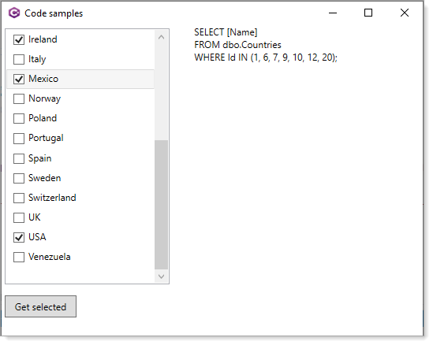
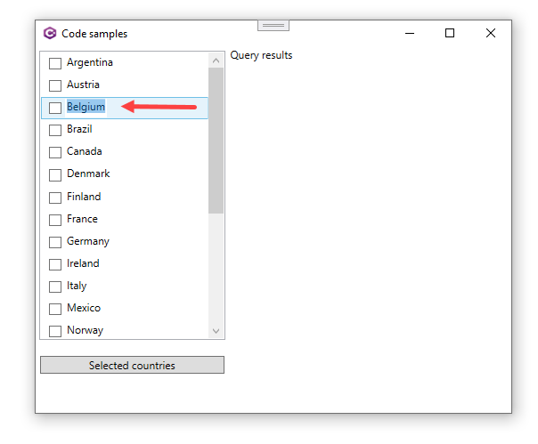

# About

Mirror of Windows Forms example with a bite more flash in regards with how the SQL is formatted.

## Notes

- In this branch there is code for editing checkboxes via placing a text box to the right of each checkbox.
- In the Get selected button there is code to get selected identifiers and current country names
  - There are separate methods to work with
- To edit a country name simply click on the name.

