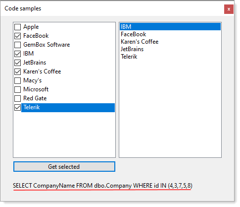
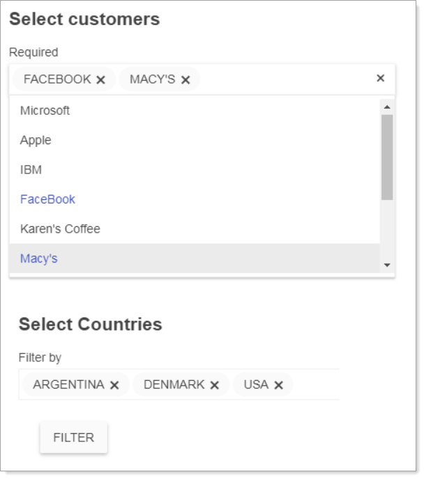
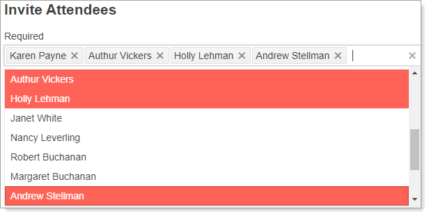
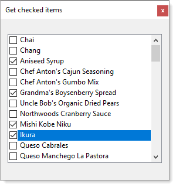
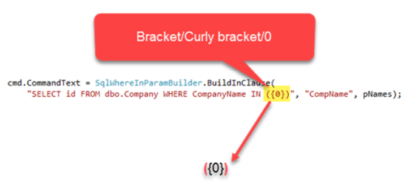

# Dynamic WHERE IN (C#)

This article provides methods for writing [SQL WHERE IN](https://docs.microsoft.com/en-us/sql/t-sql/language-elements/in-transact-sql?view=sql-server-2017) conditions in `C#` dynamically for `SQL-Server` tables using `SqlClient` data provider. `WHERE IN` condition are used to assist for an alternative to using `OR` conditions in a `SELECT` and `DELETE` statement are most common. Common reasons in a .NET solution, one example would be to allow a user to filter on customers by multiple countries while another example may be to allow a user to remove multiple customers. 

Both methods may start with a multi-select list or multi-select checkbox control/input dependent on the project type e.g. ASP.NET, WPF or Windows Forms etc.

## SQL-Server/OleDb versions

There are two versions, one for `SQL-Server` and one for `OleDb/MS-Access`. Currently the OleDb versionn has limited testing.

Example included for windows forms



Example where this might be used.







## IN vs OR

In short both return the same results yet when there are many conditions with `OR` syntax one must repeat the field name for each condition and also means when in a complex statement more to maintain.

```sql
SELECT  id
FROM    dbo.Company
WHERE   CompanyName = 'FaceBook'
        OR CompanyName = 'Macy''s';
```
While with `IN` the field name is used once, less to maintain.

```sql
SELECT  id
FROM    dbo.Company
WHERE   CompanyName IN ( 'FaceBook', 'Macy''s' );
```

To dynamically create a WHERE IN condition the type of parameter needs to be considered along with attention needs to be paid for apostrophes in string values. This means when creating parameters Command.Parameters.AddWithValue will not work properly as AddWithValue can take a numeric and convert to a string for instance. This means Command.Parameters.Add needs to be used and set [SqlDbType](https://docs.microsoft.com/en-us/dotnet/api/system.data.sqldbtype?view=net-6.0) property of a parameter to the proper type. 

For this the following method GetDbType accepts a generic type and returns the proper SqlDbType.

```csharp
using System;
using System.Collections.Generic;
using System.Data;

namespace SqlCoreUtilityLibrary.Classes
{
    public static class SqlTypeHelper
    {
        private static readonly Dictionary<Type, SqlDbType> TypeMap;

        // Create and populate the dictionary in the static constructor
        static SqlTypeHelper()
        {
            TypeMap = new Dictionary<Type, SqlDbType>
            {
                [typeof(string)] = SqlDbType.NVarChar,
                [typeof(char[])] = SqlDbType.NVarChar,
                [typeof(byte)] = SqlDbType.TinyInt,
                [typeof(short)] = SqlDbType.SmallInt,
                [typeof(int)] = SqlDbType.Int,
                [typeof(long)] = SqlDbType.BigInt,
                [typeof(byte[])] = SqlDbType.Image,
                [typeof(bool)] = SqlDbType.Bit,
                [typeof(DateTime)] = SqlDbType.DateTime2,
                [typeof(DateTimeOffset)] = SqlDbType.DateTimeOffset,
                [typeof(decimal)] = SqlDbType.Money,
                [typeof(float)] = SqlDbType.Real,
                [typeof(double)] = SqlDbType.Float,
                [typeof(TimeSpan)] = SqlDbType.Time
            };

            /* not in above then added them */
        }

        /// <summary>
        /// Get SqlDbType for givenType
        /// </summary>
        /// <param name="giveType"></param>
        /// <returns><see cref="SqlDbType"/></returns>
        public static SqlDbType GetDbType(Type giveType)
        {
            // Allow nullable types to be handled
            giveType = Nullable.GetUnderlyingType(giveType) ?? giveType;

            if (TypeMap.ContainsKey(giveType))
            {
                return TypeMap[giveType];
            }

            throw new ArgumentException($"{giveType.FullName} is not a supported .NET class");
        }
    }
}
```

GetDbType (above) is called by the following language extension method where T may be one of the types TypesMap Dictionary above.

```csharp
public static void AddParamsToCommand<T>(this SqlCommand cmd, string pPrefix, IEnumerable<T> parameters)
{
    var parameterValues = parameters.Select((paramText) => paramText.ToString()).ToArray();

    var parameterNames = parameterValues.
        Select((paramText, paramNumber) => $"@{pPrefix}{paramNumber}").ToArray();

    for (int index = 0; index < parameterNames.Length; index++)
    {
        cmd.Parameters.Add(new SqlParameter()
        {
            ParameterName = parameterNames[index],
            SqlDbType = SqlTypeHelper.GetDbType(typeof(T)),
            Value = parameterValues[index]
        });
    }
}
```

The following takes a partial WHERE IN condition e.g. SELECT Id FROM Customers WHERE Country IN ({0}). {0} will be replaced with one parameter for each value passed in from the last parameter. pPrefix prefixes each parameter name e.g. if the prefix was country and there were three country names we end up with @country1, @country2, @country3.

```csharp
public static string BuildInClause<T>(string partialClause, string pPrefix, IEnumerable<T> parameters)
{
    string[] parameterNames = parameters.Select((paramText, paramNumber) => $"@{pPrefix}{paramNumber}").ToArray();

    var inClause = string.Join(",", parameterNames);
    var whereInClause = string.Format(partialClause.Trim(), inClause);

    return whereInClause;

}
```

## Example

Using the following table

```sql
CREATE TABLE dbo.Company
    (
      id INT IDENTITY(1, 1)
             NOT NULL ,
      CompanyName NVARCHAR(MAX) NULL ,
      CONSTRAINT PK_Company PRIMARY KEY CLUSTERED ( id ASC )
        WITH ( PAD_INDEX = OFF, STATISTICS_NORECOMPUTE = OFF,
               IGNORE_DUP_KEY = OFF, ALLOW_ROW_LOCKS = ON,
               ALLOW_PAGE_LOCKS = ON ) ON [PRIMARY]
    )
ON  [PRIMARY] TEXTIMAGE_ON [PRIMARY];
```

Using a multi-select control with company names displayed and for each item in the control a primary key, pass in a list of keys or an array to the method to return records that have the keys passed in. To demonstrate this a unit test is perfect.

In the following test method primary keys are passed to a function. The variable expectedResults contain the company names expected to be returned for the keys. In a real application more than a list of strings would be returned but all we need to validate are names of companies since if these are correct the same will hold true of records or a list of a class.

```csharp
[TestMethod]
public void IntWhereConditions()
{
    // arrange
    var expectedResults = new List<string>()
    {
        "Apple",
        "FaceBook",
        "Karen's Coffee"
    };
 
    // act
    var results = GetByPrimaryKeys(new List<int>() { 2,4,5 });
 
    // assert
    Assert.IsTrue(expectedResults.SequenceEqual(results));
}
```

The following method takes each parameter, builds a parameter in cmd, the SqlCommand then sets values for each parameter.

```csharp
public List<string> GetByPrimaryKeys(List<int> pIdentifiers)
{
    mHasException = false;
    var customerList = new List<string>();
 
    using (var cn = new SqlConnection() { ConnectionString = ConnectionString })
    {
 
        using (var cmd = new SqlCommand() { Connection = cn})
        {
            // create one parameter for each key in pIdentifiers
            cmd.CommandText = SqlWhereInParamBuilder.BuildInClause(
                "SELECT CompanyName FROM dbo.Company WHERE id IN ({0})", "CompId", pIdentifiers);
 
            // populate each parameter with values from pIdentifiers
            cmd.AddParamsToCommand("CompId", pIdentifiers);
 
            try
            {
                cn.Open();
                var reader = cmd.ExecuteReader();
 
                if (reader.HasRows)
                {
                    while (reader.Read())
                    {
                        customerList.Add(reader.GetString(0));
                    }
                }
            }
            catch (Exception ex)
            {
                mHasException = true;
                mLastException = ex;
            }
        }
    }
 
    return customerList;
 
}
```

Since SqlWhereInParamBuilder.BuildInClause figured out parameter types no matter the type passed in you can pass in strings rather than a int as per the above example e.g.

```csharp
public List<int> GetCustomersKeysBack(List<string> pNames)
{
    mHasException = false;
    var customerList = new List<int>();
 
    using (var cn = new SqlConnection() { ConnectionString = ConnectionString })
    {
        using (var cmd = new SqlCommand() { Connection = cn })
        {
            // Create a parameter for each value in pNames
            cmd.CommandText = SqlWhereInParamBuilder.BuildInClause(
                "SELECT id FROM dbo.Company WHERE CompanyName IN ({0})", "CompName", pNames);
 
            // populate parameters created in BuildInClause
            cmd.AddParamsToCommand("CompName", pNames);
 
            try
            {
                cn.Open();
 
                // After running this test click on the test method calling
                // this method and select "output" to view the SELECT statement.
                Console.WriteLine(cmd.ActualCommandText());
 
                var reader = cmd.ExecuteReader();
                if (reader.HasRows)
                {
                    while (reader.Read())
                    {
                        customerList.Add(reader.GetInt32(0));
                    }
                }
            }
            catch (Exception ex)
            {
                mHasException = true;
                mLastException = ex;
            }
        }
    }
 
    return customerList;
}
```

Dates can be done also yet they are more complex depending on if there is a time aspect of the date. Images and binary types also present issues too so these methods work best with strings and numeric types.

## Usage

Include project SqlUtilityLibrary into your Visual Studio solution, add a reference to your project for SqlUtilityLibrary and write statements as per below.

```
Create the SELECT [field list] 
Append WHERE IN ({0})
```

Note parenesis then curly brace followed by 0 then close curly brace then close parenesis.




## How to use in your project

- Add the project from the code sample named SqlUtilityLibrary into your Visual Studio solution.
- Add a reference to the library in your project.
- Write SQL statements as per above.


## Running code samples

- Open BaseSqlServerConnections class in BaseLibrary project and change DatabaseServer from KARENS-PC to your server name or .\SQLEXPRESS.
- Open script.sql located in WhereConditionsTest unit test project.
- Line 7 and line 8, check the path for FILENAME, ensure it points to your SQL-Server path, if different than alter the path.
- Run the script in Visual Studio or SSMS Jump (SQL-Server Management Studio).
- In Visual Studio open Test Explorer.
- Build the solution.
- Run the test from Test Explorer or run each test one at a time.


# Original source

I wrote the following under .NET Framework 4.6. This version using .NET Core 5 along with refactors to lose code with the same functionality as the original code.

[SQL-Server dynamic C#: Dynamic WHERE IN conditions in C#for SQL Server](https://social.technet.microsoft.com/wiki/contents/articles/51874.sql-server-dynamic-c-dynamic-where-in-conditions-in-c-for-sql-server.aspx)

